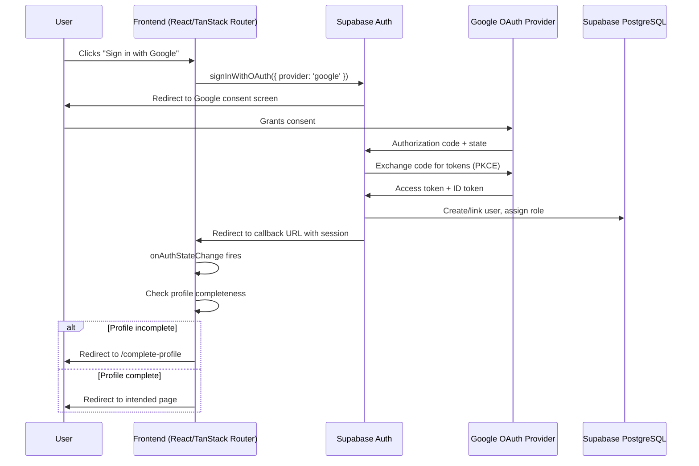
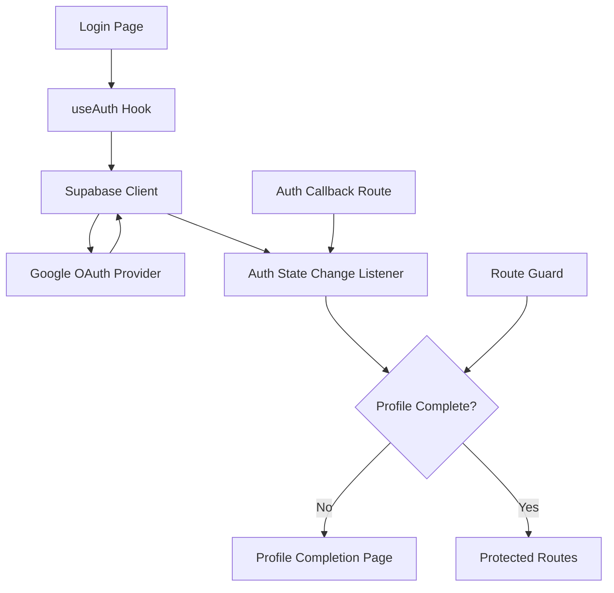
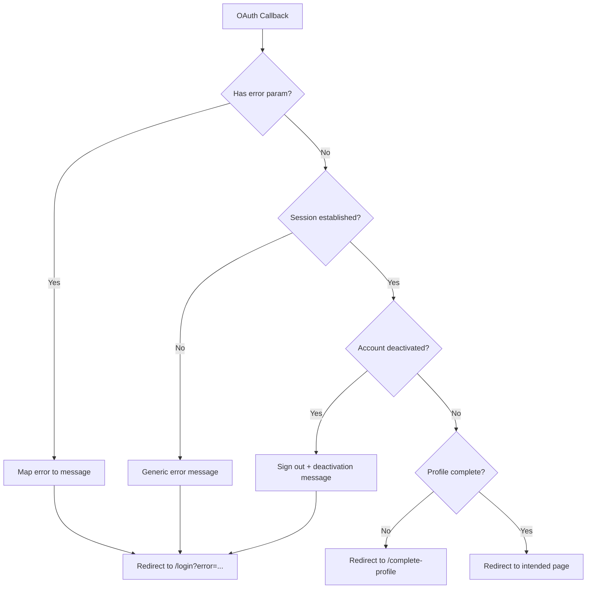

# Design Document: Google OAuth Login

## Overview

This design describes the integration of Google OAuth 2.0 as an identity provider for the Evolve Life Sciences B2B e-commerce platform. The implementation leverages Supabase's built-in OAuth support (`signInWithOAuth`) to handle the authorization code flow with PKCE, token exchange, and session management. The frontend (React/TanStack Router) initiates the flow and handles callbacks, while Supabase Auth manages token exchange, user creation/linking, and session issuance.

The existing `useAuth` hook already contains a basic `signInWithGoogle` implementation. This design extends it with proper error handling, profile completion gating, account linking awareness, and role-based access enforcement.

### Key Design Decisions

1. **Supabase-managed OAuth flow**: Supabase handles PKCE, token exchange, and ID token validation. We don't implement custom OAuth server-side logic.
2. **Profile completion gating**: New Google users are redirected to a profile completion page before accessing ordering features. This uses a route guard pattern.
3. **Account linking via email match**: Supabase automatically links Google identities to existing accounts when emails match (configured via Supabase dashboard).
4. **Role assignment via database trigger**: Default Buyer role is assigned via a Supabase database trigger on `auth.users` insert.

## Architecture



### Component Interaction Diagram



## Components and Interfaces

### 1. Supabase Client Configuration (`src/lib/supabase.ts`)

The existing Supabase client is used as-is. No changes needed — the `@supabase/supabase-js` library handles PKCE automatically for OAuth flows.

### 2. Auth Hook (`src/hooks/useAuth.tsx`)

Extended interface:

```typescript
interface AuthContextType {
  user: User | null;
  session: Session | null;
  loading: boolean;
  isProfileComplete: boolean;
  authMethod: 'google' | 'email' | null;
  signInWithGoogle: () => Promise<void>;
  signOut: () => Promise<void>;
}
```

**Changes from current implementation:**
- Add `isProfileComplete` derived from user metadata (checks for organisation_name, gst_number, phone)
- Add `authMethod` derived from `session.user.app_metadata.provider`
- Enhanced error handling in `signInWithGoogle` to catch and surface errors

### 3. OAuth Callback Handler (`src/routes/auth/callback.tsx`)

New route that handles the OAuth redirect from Supabase:

```typescript
interface CallbackParams {
  code?: string;
  error?: string;
  error_description?: string;
}
```

**Responsibilities:**
- Parse URL hash/query params from Supabase redirect
- Handle error cases (consent denied, provider unavailable, state mismatch)
- On success, trigger `onAuthStateChange` and redirect based on profile completeness

### 4. Profile Completion Page (`src/routes/complete-profile.tsx`)

New route for first-time Google OAuth users:

```typescript
interface ProfileFormData {
  organisation_name: string;
  gst_number: string;
  phone: string;
}
```

**Responsibilities:**
- Display form for organisation name, GST number, phone number
- Validate inputs (GST format, phone format)
- Update user metadata in Supabase on submission
- Redirect to home/intended page after completion

### 5. Route Guard (`src/components/auth/RouteGuard.tsx`)

A wrapper component for protected routes:

```typescript
interface RouteGuardProps {
  children: ReactNode;
  requiresProfile?: boolean;  // true for ordering/quoting routes
}
```

**Logic:**
- If not authenticated → redirect to login
- If authenticated but profile incomplete AND `requiresProfile` is true → redirect to `/complete-profile`
- Otherwise → render children

### 6. Login Page Component (`src/routes/login.tsx`)

New dedicated login page (currently sign-in is only in the header):

```typescript
interface LoginPageProps {
  error?: string;  // From OAuth callback errors
  returnTo?: string;  // URL to redirect after login
}
```

**Contains:**
- Email/password form
- "Sign in with Google" button
- Error message display area
- Link to registration

### 7. Error Display Utilities (`src/lib/auth-errors.ts`)

Maps OAuth error codes to user-friendly messages:

```typescript
type OAuthErrorCode = 
  | 'access_denied'
  | 'server_error'
  | 'temporarily_unavailable'
  | 'invalid_request';

function getOAuthErrorMessage(code: OAuthErrorCode): string;
function isDeactivatedAccountError(error: AuthError): boolean;
```

## Data Models

### User Profile (Supabase `auth.users` metadata)

```typescript
interface UserMetadata {
  // From Google OAuth (auto-populated by Supabase)
  full_name?: string;
  avatar_url?: string;
  email?: string;
  email_verified?: boolean;
  provider?: string;
  
  // Platform-specific (set via profile completion)
  organisation_name?: string;
  gst_number?: string;
  phone?: string;
}

interface AppMetadata {
  provider: 'google' | 'email';
  providers: string[];  // ['google'], ['email'], or ['email', 'google']
  role: 'buyer' | 'admin';
}
```

### Profile Completeness Check

```typescript
function isProfileComplete(user: User): boolean {
  const meta = user.user_metadata;
  return Boolean(
    meta?.organisation_name?.trim() &&
    meta?.gst_number?.trim() &&
    meta?.phone?.trim()
  );
}
```

### Database Trigger for Role Assignment

```sql
-- Trigger function to assign default Buyer role on new user creation
CREATE OR REPLACE FUNCTION public.handle_new_user()
RETURNS trigger AS $$
BEGIN
  UPDATE auth.users
  SET raw_app_meta_data = raw_app_meta_data || '{"role": "buyer"}'::jsonb
  WHERE id = NEW.id
  AND NOT (raw_app_meta_data ? 'role');
  RETURN NEW;
END;
$$ LANGUAGE plpgsql SECURITY DEFINER;

-- Trigger on auth.users insert
CREATE TRIGGER on_auth_user_created
  AFTER INSERT ON auth.users
  FOR EACH ROW EXECUTE FUNCTION public.handle_new_user();
```

### Supabase Dashboard Configuration

| Setting | Value |
|---------|-------|
| Google OAuth Provider | Enabled |
| Client ID | From Google Cloud Console |
| Client Secret | From Google Cloud Console |
| Redirect URL | `https://<project>.supabase.co/auth/v1/callback` |
| Scopes | `openid email profile` |
| PKCE | Enabled (default) |
| Auto-link accounts | Enabled (match by email) |

## Correctness Properties

*A property is a characteristic or behavior that should hold true across all valid executions of a system — essentially, a formal statement about what the system should do. Properties serve as the bridge between human-readable specifications and machine-verifiable correctness guarantees.*

### Property 1: OAuth Error Callback Produces Descriptive Error

*For any* valid OAuth error code returned in the callback URL, the error handler should redirect to the login page and produce a non-empty, user-friendly error message that does not expose internal implementation details.

**Validates: Requirements 2.3**

### Property 2: New Google OAuth Users Receive Buyer Role

*For any* new user created via Google OAuth (where no prior account exists), the assigned role in app_metadata should be "buyer".

**Validates: Requirements 3.2**

### Property 3: Incomplete Profile Access Control

*For any* authenticated user whose profile is incomplete (missing organisation_name, gst_number, or phone), navigation to ordering or quotation routes should be blocked with a redirect to the profile completion page, while catalogue browsing routes remain accessible.

**Validates: Requirements 3.4, 3.5**

### Property 4: Account Linking Preserves Identity and Data

*For any* existing user with email E, role R, organisation O, GST G, and order history H, when a Google OAuth sign-in occurs with the same email E, the resulting account should have exactly one record with email E, role R, organisation O, GST G, and order history H preserved.

**Validates: Requirements 4.1, 4.2**

### Property 5: No Cross-Email Account Linking

*For any* pair of distinct email addresses (existing account email ≠ Google account email), a Google OAuth sign-in should result in a new, separate account rather than linking to the existing account.

**Validates: Requirements 4.4**

### Property 6: JWT Session Consistency Across Auth Methods

*For any* session created via Google OAuth, the JWT token should contain the same base claims (sub, email, role, exp, iat) as an email/password session, plus an additional provider/auth_method claim identifying the authentication method used.

**Validates: Requirements 5.1, 5.2**

### Property 7: Sign-Out Invalidates Any Session

*For any* active session (whether created via Google OAuth or email/password), invoking sign-out should result in the session being invalidated such that subsequent authenticated requests are rejected.

**Validates: Requirements 5.4**

### Property 8: Deactivated Account Rejection

*For any* deactivated user account on the platform, a Google OAuth sign-in attempt with the matching email should be rejected with an appropriate error message, and no session should be created.

**Validates: Requirements 6.3**

### Property 9: No Client-Side Token Storage

*For any* completed Google OAuth flow, no Google access tokens or refresh tokens should be present in client-side storage (localStorage, sessionStorage, or JavaScript-accessible cookies). Only the Supabase session JWT should persist client-side.

**Validates: Requirements 7.5**

## Error Handling

### Error Categories and Responses

| Error Scenario | Source | User Message | Action |
|---|---|---|---|
| Consent denied | Google callback `error=access_denied` | "Google sign-in was cancelled. You can try again or use email/password." | Redirect to login |
| Provider unavailable | Network error / Google 5xx | "Google sign-in is temporarily unavailable. Please try again later or sign in with email/password." | Redirect to login |
| State mismatch (CSRF) | Supabase PKCE validation | "Sign-in failed due to a security error. Please try again." | Redirect to login, log security event |
| Deactivated account | Platform DB check | "This account has been deactivated. Please contact support." | Redirect to login |
| Token exchange failure | Supabase ↔ Google | "Sign-in failed. Please try again." | Redirect to login |
| Profile update failure | Supabase DB | "Failed to save profile. Please try again." | Stay on form, show toast |

### Error Flow



### Retry Strategy

- OAuth initiation failures: User can retry by clicking the button again
- Network failures during callback: Display error with "Try again" button
- Profile save failures: Keep form state, show toast, allow retry
- No automatic retries for security-sensitive operations

## Testing Strategy

### Unit Tests (Example-Based)

- **Login page rendering**: Verify "Sign in with Google" button is present (Req 1.1, 1.4)
- **Consent denied handling**: Simulate `access_denied` callback and verify error display (Req 6.1)
- **Provider unavailable**: Mock network failure and verify fallback message (Req 6.2)
- **State mismatch**: Simulate invalid state and verify security error (Req 6.4)
- **Session expiry redirect**: Simulate expired session and verify login redirect (Req 5.3)
- **OAuth scope configuration**: Verify scopes include openid, email, profile (Req 1.3)

### Property-Based Tests

Property-based testing is applicable to this feature for the pure logic components (error mapping, profile completeness checking, access control decisions, token claim validation). The OAuth flow itself is integration-heavy, but the decision logic that routes users based on state is pure and benefits from PBT.

**Library**: [fast-check](https://github.com/dubzzz/fast-check) (already compatible with Vite/Vitest ecosystem)

**Configuration**:
- Minimum 100 iterations per property test
- Each test tagged with: `Feature: google-oauth-login, Property {N}: {description}`

**Properties to implement:**
1. Error code → message mapping (Property 1)
2. Role assignment for new users (Property 2)
3. Profile completeness gating logic (Property 3)
4. Account data preservation on link (Property 4)
5. Email mismatch → no linking (Property 5)
6. JWT claim consistency (Property 6)
7. Sign-out invalidation (Property 7)
8. Deactivated account rejection (Property 8)
9. No client-side token leakage (Property 9)

### Integration Tests

- Full Google OAuth flow with Supabase test project
- Account linking with pre-existing email/password account
- Profile completion flow end-to-end
- Session refresh and token rotation
- Concurrent sign-in attempts

### Test Environment

- **Unit/Property tests**: Vitest + fast-check + mock Supabase client
- **Integration tests**: Supabase local development instance (via Docker) with seeded test data
- **E2E tests** (future): Playwright with Google test account credentials
