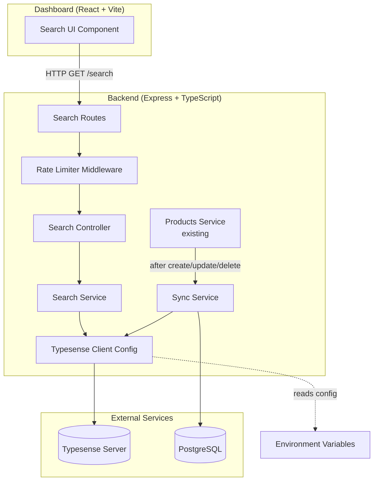

# Design Document: Typesense Search Integration

## Overview

This design integrates Typesense as the search engine for the Evolve lab chemicals e-commerce platform, replacing the existing PostgreSQL `LIKE`-based search in the products service. The integration adds a new `search` backend module following the project's modular architecture pattern (controller, service, routes, validation), a Typesense client configuration module, a data synchronization service, and a frontend search UI component.

The key architectural decision is to treat Typesense as a read-optimized projection of the PostgreSQL products table. PostgreSQL remains the source of truth, with a sync layer that propagates changes to Typesense. Search queries go directly to Typesense for sub-200ms response times, while write operations continue through the existing products module with post-write hooks triggering synchronization.

## Architecture



### Data Flow

1. **Search query flow**: Client → Rate Limiter → Search Controller → Search Service → Typesense → Response transformation → Client
2. **Sync flow (on write)**: Products Service → Sync Service → Typesense (upsert/delete)
3. **Full re-index flow**: Admin trigger → Sync Service → PostgreSQL (read all active) → Typesense (bulk import with alias swap)

### Key Design Decisions

| Decision | Rationale |
|----------|-----------|
| Post-write hook sync (not CDC/event) | Simple, fits existing Express architecture; no message broker needed for current scale |
| Alias-based re-index | Allows zero-downtime full re-index by building new collection then swapping alias |
| In-memory rate limiter (Map-based) | Avoids Redis dependency; suitable for single-node deployment |
| Typesense client as singleton | Single connection pool, lazy initialization on first request |
| Search endpoint is public | Matches existing `/products` public GET pattern; no auth friction for browsing |

## Components and Interfaces

### Backend Module: `src/modules/search/`

```
src/modules/search/
├── search.routes.ts        # Express router with rate limiting
├── search.controller.ts    # Request handling, validation, response formatting
├── search.service.ts       # Typesense query construction and execution
├── search.validation.ts    # Zod schemas for search/filter params
├── sync.service.ts         # Data sync between PostgreSQL and Typesense
└── typesense.client.ts     # Client initialization and schema definition
```

### Backend Config: `src/config/typesense.ts`

Environment variable parsing and validation for Typesense connection.

### Backend Middleware: `src/middleware/rateLimit.ts`

IP-based sliding window rate limiter.

### Interfaces

```typescript
// typesense.client.ts
interface TypesenseConfig {
  host: string;
  port: number;
  protocol: "http" | "https";
  apiKey: string;
}

// Product document shape in Typesense
interface ProductDocument {
  id: string;
  name: string;
  description: string;
  category: string;
  brand_name: string;
  cas_number: string;
  catalog_number: string;
  price: number;
  pack_size: string;
  stock: number;
}

// search.validation.ts
interface SearchQuery {
  q: string;          // 0-256 chars
  page: number;       // 1+, default 1
  per_page: number;   // 1-100, default 20
  category?: string;
  brand?: string;
  min_price?: number; // >= 0.01
  max_price?: number; // <= 99,999,999.99
}

// search.service.ts - response types
interface SearchResult {
  id: string;
  name: string;
  slug: string;
  description: string | null;
  category: string | null;
  brand_name: string | null;
  price: number;
  currency: string;
  pack_size: string | null;
  image_url: string | null;
  stock: number;
  highlights: SearchHighlight;
}

interface SearchHighlight {
  name?: string;
  description?: string;
  cas_number?: string;
}

interface FacetEntry {
  value: string;
  count: number;
}

interface SearchResponse {
  results: SearchResult[];
  facets: {
    category: FacetEntry[];
    brand: FacetEntry[];
  };
  meta: {
    total: number;
    page: number;
    total_pages: number;
    processing_time_ms: number;
  };
}

// sync.service.ts
interface SyncService {
  indexProduct(product: Product): Promise<void>;
  updateProduct(product: Product): Promise<void>;
  removeProduct(productId: string): Promise<void>;
  fullReindex(): Promise<void>;
}

// middleware/rateLimit.ts
interface RateLimitConfig {
  windowMs: number;    // 60000 (1 minute)
  maxRequests: number; // 60
}
```

### Frontend Component: `src/components/SearchBar.tsx`

```typescript
interface SearchBarProps {
  onNavigate?: (slug: string) => void;
}

// Internal state
interface SearchState {
  query: string;
  results: SearchResult[];
  facets: { category: FacetEntry[]; brand: FacetEntry[] };
  filters: { category?: string; brand?: string; min_price?: number; max_price?: number };
  loading: boolean;
  meta: { total: number; page: number; total_pages: number };
}
```

## Data Models

### Typesense Collection Schema

```json
{
  "name": "products",
  "fields": [
    { "name": "id", "type": "string" },
    { "name": "name", "type": "string" },
    { "name": "description", "type": "string" },
    { "name": "category", "type": "string", "facet": true },
    { "name": "brand_name", "type": "string", "facet": true },
    { "name": "cas_number", "type": "string" },
    { "name": "catalog_number", "type": "string" },
    { "name": "price", "type": "float" },
    { "name": "pack_size", "type": "string" },
    { "name": "stock", "type": "int32" }
  ],
  "default_sorting_field": "stock"
}
```

### PostgreSQL-to-Typesense Field Mapping

| PostgreSQL (Prisma) | Typesense Field | Transform |
|---------------------|-----------------|-----------|
| `id` (uuid) | `id` (string) | Direct |
| `name` | `name` | Direct |
| `description` | `description` | Null → empty string |
| `category` | `category` | Null → empty string |
| `brand.name` | `brand_name` | Join via `brandId`, null → empty string |
| `casNumber` | `cas_number` | Null → empty string |
| `catalogNumber` | `catalog_number` | Null → empty string |
| `price` (Decimal) | `price` (float) | `Number(price)` |
| `packSize` | `pack_size` | Null → empty string |
| `stock` (int) | `stock` (int32) | Direct |

### API Endpoints

| Method | Path | Auth | Rate Limited | Description |
|--------|------|------|--------------|-------------|
| GET | `/search` | None | Yes (60/min) | Search products with facets |
| POST | `/search/reindex` | Admin Bearer | No | Trigger full re-index |

### Environment Variables (additions to `.env`)

```
TYPESENSE_HOST=localhost
TYPESENSE_PORT=8108
TYPESENSE_PROTOCOL=http
TYPESENSE_API_KEY=your-api-key-here
```

## Correctness Properties

*A property is a characteristic or behavior that should hold true across all valid executions of a system—essentially, a formal statement about what the system should do. Properties serve as the bridge between human-readable specifications and machine-verifiable correctness guarantees.*

### Property 1: Product-to-document mapping preserves all fields

*For any* valid Product record from PostgreSQL (with any combination of null/non-null optional fields and any valid brand relation), transforming it to a Typesense ProductDocument SHALL produce a document where: id matches, name matches, numeric price equals `Number(product.price)`, stock matches, and all nullable string fields default to empty string when null.

**Validates: Requirements 2.1, 2.2, 2.4**

### Property 2: Search query length validation

*For any* string of length 1 to 256 characters, the search query validator SHALL accept it as valid; for any string of length greater than 256 characters, the validator SHALL reject it.

**Validates: Requirements 3.1**

### Property 3: Pagination parameter validation

*For any* integer value for `per_page`, the validator SHALL accept values in [1, 100], reject values outside that range, and default to 20 when not provided. For any integer value for `page`, the validator SHALL accept values >= 1 and reject values < 1.

**Validates: Requirements 3.5**

### Property 4: Facet response transformation

*For any* Typesense facet_counts array in a search response, the transformation SHALL produce an object with `category` and `brand` arrays where each entry contains a `value` (string) and `count` (positive integer), preserving all entries and their counts from the raw Typesense response.

**Validates: Requirements 4.1**

### Property 5: Filter string construction

*For any* valid category string, brand string, or price range (min >= 0.01, max <= 99,999,999.99, min <= max), the filter builder SHALL produce a syntactically valid Typesense `filter_by` string: exact match for category/brand (`field:=value`) and numeric range for price (`price:>= min && price:<= max`).

**Validates: Requirements 4.2, 4.3, 4.4**

### Property 6: Combined filter AND logic

*For any* combination of active filters (0 to 3 of: category, brand, price range), the filter builder SHALL join individual filter clauses with ` && ` operator, producing a single `filter_by` string that applies all filters simultaneously.

**Validates: Requirements 4.6**

### Property 7: Result transformation completeness

*For any* Typesense search hit document (with any combination of present/missing fields), the result transformer SHALL produce an object containing exactly the keys: `id`, `name`, `slug`, `description`, `category`, `brand_name`, `price`, `currency`, `pack_size`, `image_url`, `stock`, and `highlights`, where missing optional fields are set to `null`.

**Validates: Requirements 5.1, 5.5**

### Property 8: Highlight snippet truncation

*For any* Typesense highlight snippet string, the highlight transformer SHALL return a string of at most 200 characters. If truncation is needed, it SHALL preserve complete `<em>` tag pairs (not split mid-tag).

**Validates: Requirements 5.2**

### Property 9: Response metadata mapping

*For any* Typesense search response containing `found`, `page`, and `search_time_ms` fields, the metadata transformer SHALL produce an object with `total` equal to `found`, `page` equal to the request page, `total_pages` equal to `ceil(found / per_page)`, and `processing_time_ms` equal to `search_time_ms`.

**Validates: Requirements 5.3**

### Property 10: Rate limiter sliding window

*For any* sequence of request timestamps from a single IP, the rate limiter SHALL allow requests when fewer than 60 timestamps fall within the most recent 60-second window, and SHALL reject with 429 when 60 or more timestamps fall within that window.

**Validates: Requirements 7.3**

### Property 11: Environment variable validation

*For any* combination of environment variable values, the validator SHALL: accept TYPESENSE_PORT only when it is an integer in [1, 65535]; accept TYPESENSE_PROTOCOL only when it is "http" or "https"; reject and report each variable that is missing or invalid; and prevent initialization when any validation fails.

**Validates: Requirements 8.2, 8.3**

## Error Handling

### Error Categories and Responses

| Scenario | HTTP Status | Response Body | Retry Behavior |
|----------|-------------|---------------|----------------|
| Typesense unreachable (search) | 503 | `{ "message": "Search is temporarily unavailable" }` | Client may retry after delay |
| Typesense unreachable (sync) | N/A (background) | Logged, retried 3× with exponential backoff | Automatic |
| Invalid search params | 400 | `{ "message": "..." , "errors": [...] }` | Client fixes input |
| Price min > max | 400 | `{ "message": "Minimum price must not exceed maximum price" }` | Client fixes input |
| Rate limit exceeded | 429 | `{ "message": "Rate limit exceeded" }` + `Retry-After` header | Client waits |
| Re-index without auth | 401 | `{ "message": "Authentication required" }` | Client provides token |
| Re-index without admin role | 403 | `{ "message": "Insufficient permissions" }` | N/A |
| Missing env vars at startup | N/A | Log error, module fails to init | Fix configuration |
| Sync retry exhausted | N/A (background) | Log error with product ID, skip operation | Next sync works independently |

### Retry Strategy

- **Collection creation**: 3 retries, fixed 2-second delay
- **Sync operations**: 3 retries, exponential backoff (1s → 2s → 4s)
- **Search queries**: No retry (return 503 immediately to client within 3s timeout)

### Graceful Degradation

When Typesense is unavailable:
- Search endpoint returns 503 with clear message
- Product CRUD operations continue normally (PostgreSQL unaffected)
- Sync operations queue failures and log; subsequent operations are not blocked
- On reconnection, a full re-index can restore consistency

## Testing Strategy

### Property-Based Tests (using `fast-check`)

The `fast-check` library will be used for property-based testing in TypeScript. Each property test runs a minimum of 100 iterations with randomly generated inputs.

Property tests focus on the pure transformation and validation logic:
- Document mapping function (Property 1)
- Query/pagination validators (Properties 2, 3)
- Facet response transformer (Property 4)
- Filter string builder (Properties 5, 6)
- Result transformer (Property 7)
- Highlight truncation (Property 8)
- Metadata mapper (Property 9)
- Rate limiter decision function (Property 10)
- Env validation (Property 11)

Each test tagged with: `Feature: typesense-search, Property {N}: {title}`

### Unit Tests (using `vitest`)

- Search controller: verify correct status codes and response shapes for edge cases (empty query, no results, invalid params)
- Sync service: verify retry logic with mocked Typesense client (failure counting, backoff timing)
- Collection initialization: verify skip behavior when collection exists
- Rate limiter middleware: verify Retry-After header value calculation

### Integration Tests

- Search with known seeded data: verify relevance ranking, typo tolerance, facet counts
- Full re-index: verify data consistency and zero-downtime (alias swap)
- Auth/authz on re-index endpoint: verify 401/403 responses
- Rate limiting: verify 429 after 60 rapid requests

### Frontend Component Tests

- SearchBar: debounce timing, loading state display, navigation on selection
- Filter panel: filter application without page reload, facet count updates
